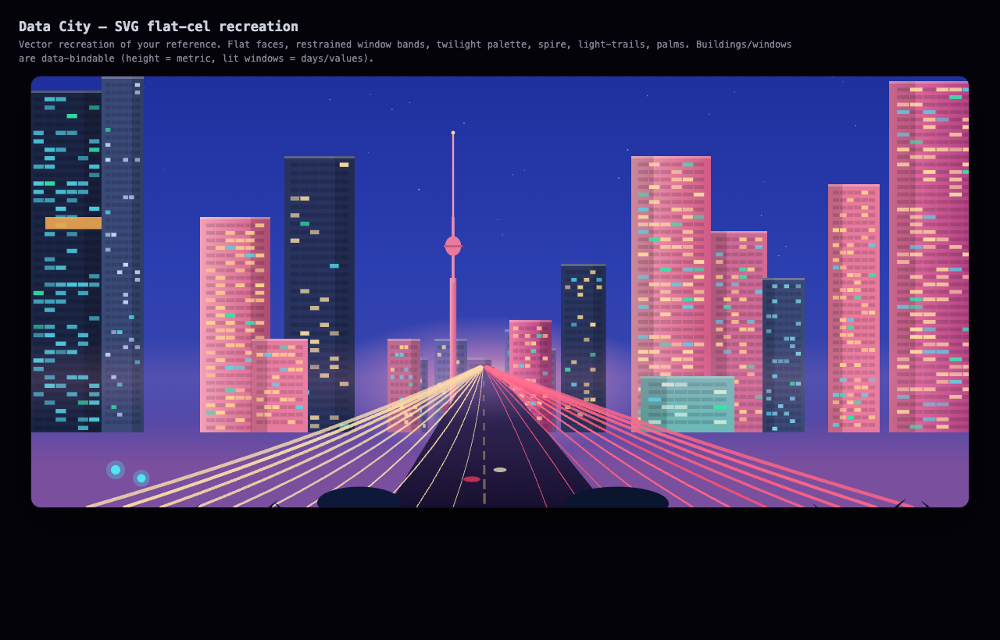
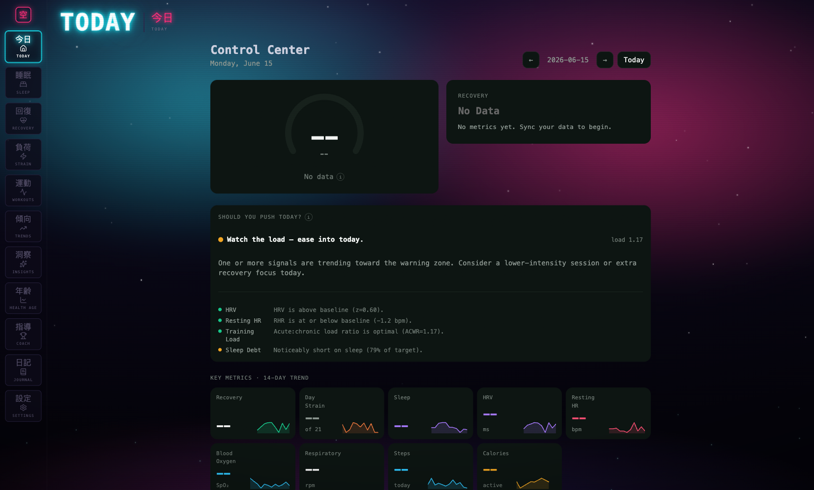
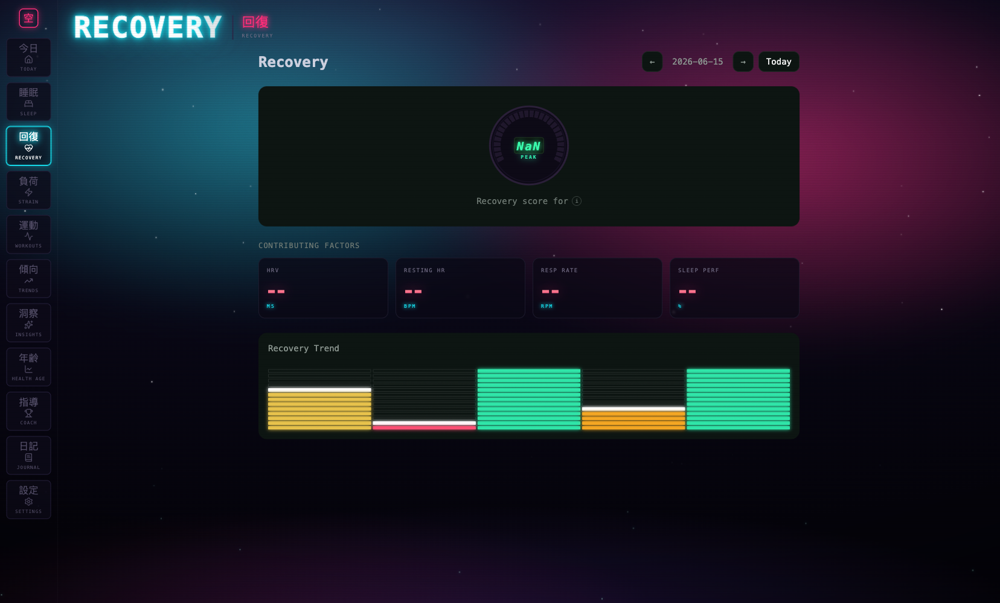
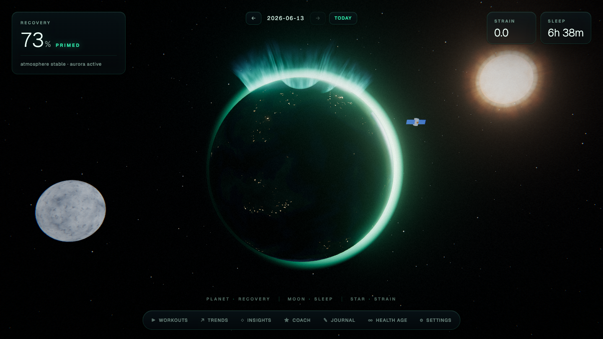
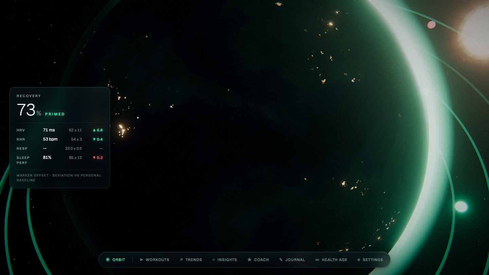
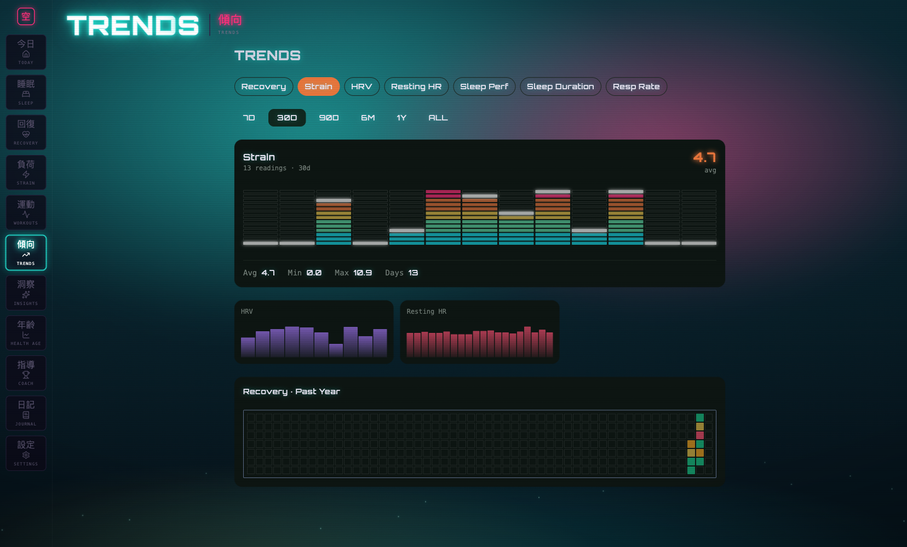
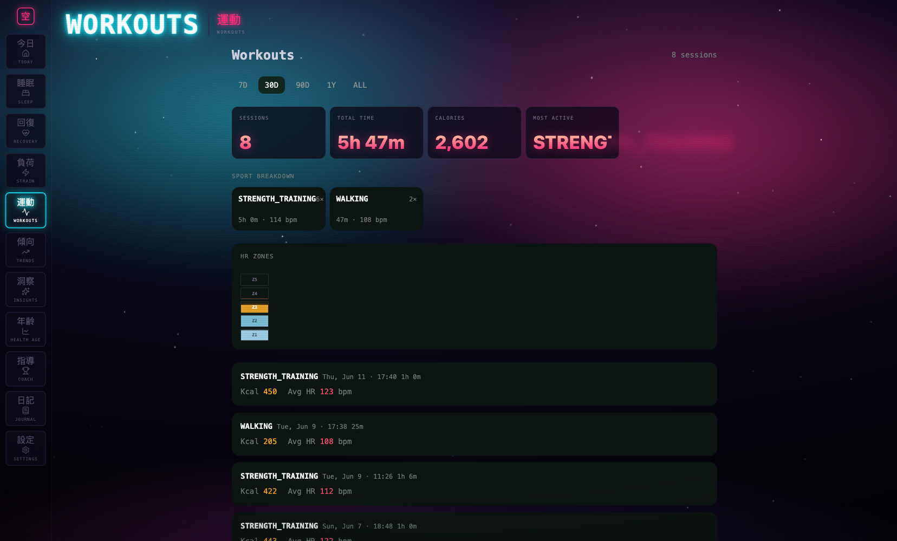

<h1 align="center">AirMG</h1>

<p align="center"><b>Your health data. Your machine. The recovery, strain and sleep analytics you already pay a subscription for — running locally, for free.</b></p>

<p align="center">
  
  
  
  
  
</p>

<p align="center">
  <a href="#what-it-is">What it is</a> ·
  <a href="#screenshots">Screenshots</a> ·
  <a href="#quickstart">Quickstart</a> ·
  <a href="#architecture">Architecture</a> ·
  <a href="#themes">Themes</a> ·
  <a href="#credits">Credits</a>
</p>

<p align="center">
  
</p>

---

## What it is

WHOOP built a **$10B+ business** on a simple idea: take the biometric data your body produces every
day — heart rate, HRV, sleep stages, respiratory rate — and turn it into three numbers that actually
change behaviour: **Recovery**, **Strain**, **Sleep Performance**. The hardware is commodity. The
moat is the analytics layer and the subscription wrapped around your own data.

**AirMG is that analytics layer, rebuilt by one engineer, running entirely on your own machine.**

It reads the health data you already own through the **Google Health API**, stores it in a local
SQLite database that never leaves your laptop, and computes a full recovery/strain/sleep/health-age
model on top of it — then renders it through a dashboard that ranges from a clean data view to a
fully 3D "data city" you can fly through.

No account. No cloud. No subscription. The data is yours; AirMG just does the math on it, locally.

### Highlights

- **Local-first & private** — your data lives in `~/.airmg/airmg.db` on your machine. The only
  network call is the OAuth handshake and the read-only sync from Google Health.
- **A real analytics engine** — recovery, strain, sleep scoring, personalised rolling baselines,
  HR zones, training load, behavioural insights, a coach, and a "health age" model. Not mock data —
  `backend/src/airmg/analytics/` is the product.
- **Twelve dashboards** — Today, Sleep, Recovery, Strain, Workouts, Trends, Insights, Health Age,
  Coach, Journal, Settings, Onboarding.
- **Four switchable themes** — from a focused dark dashboard to a WebGL orbital data-city and a
  neon "Radio City" skin. One data model, four ways to see it.
- **Genuinely full stack** — typed Python analytics backend, React 19 + TypeScript frontend,
  real-time 3D (three.js / React Three Fiber), and a tested data pipeline.

## Screenshots

| Radio City — Today | Radio City — Recovery |
|---|---|
|  |  |

| Orbital data-city — Landing | Orbital — Recovery |
|---|---|
|  |  |

| Trends | Workouts — HR zone stack |
|---|---|
|  |  |

## Quickstart

> Full walkthrough — including the Google Cloud OAuth setup — is in **[docs/SETUP.md](docs/SETUP.md)**.

**Prerequisites:** Python 3.13+ with [`uv`](https://docs.astral.sh/uv/), Node 20+, and a Google
Cloud OAuth client (`client_secret.json`) with the Google Health read-only scopes enabled.

```bash
# 1. Backend (terminal 1) — http://127.0.0.1:8000
cd backend
uv sync
uv run airmg                      # serves the API + docs at /docs

# 2. Frontend (terminal 2) — http://localhost:5173
cd frontend
npm install
npm run dev
```

Then open **http://localhost:5173**, click **Connect**, complete the Google sign-in, and run your
first sync. Your data and tokens stay in `~/.airmg/`.

## Architecture

```
┌─────────────────────┐      OAuth + read-only sync      ┌────────────────────┐
│   Google Health API │ ───────────────────────────────▶ │  AirMG backend     │
└─────────────────────┘                                   │  (FastAPI, :8000)  │
                                                          │                    │
   ~/.airmg/airmg.db  ◀──────  store/ (SQLite)  ──────────│  sync ▸ mapper     │
   ~/.airmg/tokens.json                                   │  analytics engine  │
                                                          │  routes (/api/…)   │
                                                          └─────────┬──────────┘
                                                                    │ JSON over HTTP
                                                          ┌─────────▼──────────┐
                                                          │  Frontend (:5173)  │
                                                          │  React 19 + Vite   │
                                                          │  4 themes, R3F 3D  │
                                                          └────────────────────┘
```

- **`backend/`** — Python 3.13, FastAPI. OAuth (`auth/`), Google Health sync + mapping (`sync/`),
  the analytics engine (`analytics/`: recovery, strain, sleep score, baselines, zones, health age,
  behaviours), per-feature API routers (`routes/`), and a SQLite store (`store/`). Managed with `uv`.
- **`frontend/`** — React 19 + TypeScript + Vite. Data via TanStack Query, state via Jotai. Pages
  are theme-agnostic compositions of shared chart components; the active theme (`atoms/theme.ts`)
  swaps the shell + visuals — including a full WebGL scene (`orbital/`, three.js / R3F) and the
  DOM/SVG neon skin (`radio/`).

Deeper dive: **[docs/ARCHITECTURE.md](docs/ARCHITECTURE.md)**.

## Themes

AirMG ships **four** interchangeable presentations of the same data model, selectable in Settings:

| Theme | What it is |
|---|---|
| **dark** | Focused, fast, no-nonsense dashboard. The default. |
| **liquid-glass** | Frosted-glass cards, depth and blur. |
| **orbital** | A 3D WebGL "data city" — fly through your metrics as an orbital scene (three.js / R3F). |
| **radio** | "Radio City" — a Halt-and-Catch-Fire neon City-Pop skin: living night sky, neon billboards, CRT grain. DOM/CSS/SVG only. |

## Status

This is a personal project and a portfolio piece, not a commercial product. It is **not a medical
device** — every metric is an approximation and is not clinically validated. See
[`ATTRIBUTION.md`](ATTRIBUTION.md).

## Credits

AirMG exists because of **[NOOP](https://github.com/NoopApp/noop)** (`NoopApp/noop`) — the
local-first WHOOP companion that proved "your strap, your data, your machine" works. AirMG borrows
NOOP's philosophy and product shape; it shares **no code** (NOOP is Swift + WHOOP BLE, AirMG is
Python + TypeScript + Google Health). Full credits — including NOOP's own upstream
reverse-engineering credits — are in **[ATTRIBUTION.md](ATTRIBUTION.md)**.

If you own a WHOOP strap, go support the original: **https://github.com/NoopApp/noop**.

## License

[Apache License 2.0](LICENSE) © 2026 Surya Prasad. Contributions welcome — see
[CONTRIBUTING.md](CONTRIBUTING.md).
